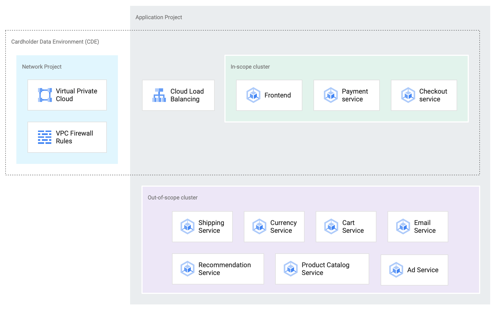

# PCI on Anthos Blueprint

# Contents

- [Introduction](#introduction)
- [Requirements](#requirements)
- [Deployment](docs/deployment.md)
- [DNS Configuration](docs/dns.md)
- [Known Issues](#known-issues)

## Introduction

This repository is a Blueprint for a PCI compliant (pending review) cloud infrastructure implemented on Anthos. Included are configuration files to build and deploy an infrastructure that demonstrates a sample architecture and running application.

When completed, the deployed resources include two [GKE clusters](https://cloud.google.com/kubernetes-engine) in a dedicated shared VPC configured with [private networking](https://cloud.google.com/kubernetes-engine/docs/concepts/private-cluster-concept). The two clusters will have [Anthos Service Mesh](https://cloud.google.com/anthos/service-mesh) installed and configured as a single multi-cluster service mesh. Additionally, they are configured to use [Anthos Config Management](https://cloud.google.com/anthos/config-management), which in turn controls the namespaces, policies, [policy controller configuration](https://cloud.google.com/anthos-config-management/docs/concepts/policy-controller), and other resources applied to both clusters.

An open-source, containerized, ecommerce microservice application ([microservices-demo](https://github.com/GoogleCloudPlatform/microservices-demo)) is included as a working application for demonstration purposes. The application is load balanced using [GCP HTTP(S) Load Balancing](https://cloud.google.com/load-balancing/docs/https), with TLS provided by [Google-managed SSL Certificates](https://cloud.google.com/load-balancing/docs/ssl-certificates/google-managed-certs).

A [Cloud Build configuration](https://cloud.google.com/cloud-build) automates the management of the infrastructure via [Terraform](https://www.terraform.io), as well as the installation of Anthos Config Management, Anthos Service Mesh and the deployment of the demo application.

> PCI Scope, Cluster, and Workload Layout

This blueprint contains everything needed to generate these resources. In order to get started, review the Requirements section below, then follow the steps in [Deployment](docs/deployment.md).

## Requirements

Below is a list of requirements that will need to be satisfied before beginning the installation.

* These docs, unless otherwise stated, assume a single GCP organization, and that the user is a member of the Organization Admin role.
* A billing account with sufficient quota is required.
* Terraform, bash, and [gcloud](https://cloud.google.com/sdk/install) are required. For directly interacting with the clusters and troubleshooting, [kubectl](https://kubernetes.io/docs/tasks/tools/install-kubectl/), is needed.  For gcloud, the CLI user [needs to be authenticated](https://cloud.google.com/sdk/gcloud/reference/auth/login).
* In order to provide the demonstration frontend securely via `https`, Google-managed SSL-certificates are used, which require correctly configured DNS records. Because of this, management access to a registered  DNS subdomain is required.  See [DNS Configuration](docs/dns.md) for additional details.
* In order to configure Anthos Config Management, a hosted git repository dedicated for this purpose is required. While other methods are possible and supported, currently in this project only details for connecting via GitHub are provided.

## Known Issues

* Inspecting the Ingress resource for the frontend (`kubectl --context in-scope -n frontend describe ingress frontend`) can include a warning such as `invalid ingress frontend configuration` even after successfully creating the resource. See https://github.com/kubernetes/ingress-gce/issues/1214
* Some verified billing accounts don't have sufficient quota.
* As currently implemented, mTLS strict is set to be enforced on the service mesh. However, traffic between the frontend's load balancers and the frontend service is not inside the service mesh and thus isn't included in mTLS. This aspect should be evaluated on a case by case basis. This traffic is encrypted via network level encryption, as described in [How traffic gets routed](https://cloud.google.com/security/encryption-in-transit#how_traffic_gets_routed).
