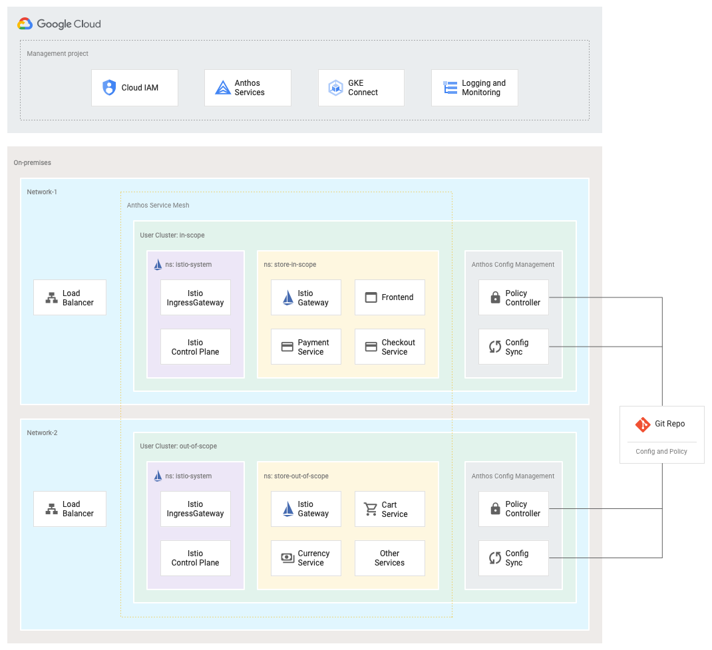

# Anthos Blueprint: PCI compliance baseline using Anthos on-prem
This repo contains a sample app and configuration that provides a baseline for addressing
Payment Card Industry Data Security Standard (PCI DSS) compliance requirements using 
[Anthos clusters on VMware](https://cloud.google.com/anthos/gke/docs/on-prem/overview) (GKE on-prem).

As a companion to this repo and instructions you are strongly advised to read:
* the associated [PCI for Anthos on-prem](https://cloud.google.com/architecture/blueprints/gke--on-prem-pci-dss-blueprint) 
user guide
* the GKE on-prem [security overview](https://cloud.google.com/anthos/gke/docs/on-prem/concepts/security)
* the GKE on-prem [cluster hardening guide](https://cloud.google.com/anthos/gke/docs/on-prem/how-to/hardening-your-cluster)


## Caveats
This blueprint is provided with the following caveats and limitations:
* This blueprint is for demonstration purposes only
* The blueprint addresses a subset of PCI DSS requirements; implementing the blueprint does **not** provide full compliance 
* Securing Anthos GKE on-prem is a [shared responsibiltiy](http://cloud/anthos/docs/concepts/gke-shared-responsibility). 
For example, you are responsible for:
  * Appropriately segmenting the underlying vSphere networks
  * Configuring appropriate firewall rules
  * Operating, maintaining, and patching infrastructure, including networks, servers and storage 

## Architecture


## Summary
In this blueprint you:
 * Use the [Online Boutique](https://github.com/GoogleCloudPlatform/microservices-demo) demo ecommerce app
 * Split the Online Boutique microservices over two distinct GKE on-prem clusters
   * Microservices that handle cardholder data are in scope for PCI compliance and are deployed 
   to an `in-scope` GKE on-prem cluster
   * Other microservices are not in scope for PCI compliance and are deployed to an `out-of-scope` 
   GKE on-prem cluster. 
 * Place the in-scope and out-of-scope GKE clusters on separate underlying networks
 * Use [Anthos Config Management](https://cloud.google.com/anthos/config-management) to apply 
 and maintain appropriate cluster configuration, synced from a Git repo
 * Use [Anthos Service Mesh](https://cloud.google.com/anthos/service-mesh) to secure and constrain 
 traffic within and across the GKE on-prem clusters

## Supported versions
This installation has been tested and verified against the following versions:
* GKE on-prem: 1.5.2-gke.3, and Anthos Service Mesh: 1.7.3-asm.6
  * **NOTE** that multi-cluster Anthos Service Mesh is not officially supported until ASM 1.8
* GKE on-prem: 1.6.0-gke.7, and Anthos Service Mesh: 1.8.1-asm.5


## Security controls
This section describes the security controls used by the blueprint.

### GKE on-prem
GKE on-prem provides features that can help you address PCI requirements. Refer to the GKE on-prem [Security overview](https://cloud.google.com/anthos/gke/docs/on-prem/1.6/concepts/security)
documentation 
* GKE on-prem VMware node images come preconfigured with PCI DSS, NIST Baseline High, and DoD Cloud Computing SRG Impact
Level 2 settings. See the [node compliance](https://cloud.google.com/anthos/gke/docs/on-prem/concepts/node-compliance) docs
* Enable [audit logging](https://cloud.google.com/anthos/gke/docs/on-prem/how-to/audit-logging) to send Admin Activity
audit log entries from all Kubernetes API servers to Cloud Logging
* Configure [OpenID Connect](https://cloud.google.com/anthos/gke/docs/on-prem/how-to/oidc) for user authentication to
your user clusters. Use Kubernetes Role-Based Access Control (RBAC) for to configure more granular access to Kubernetes 
resources

### Network controls
Configuring the underlying vSphere networks is outside the scope of the blueprint. Refer to the GKE on-prem [networking overview](https://cloud.google.com/anthos/gke/docs/on-prem/concepts/networking)
and the related [vSphere network requirements](https://cloud.google.com/anthos/gke/docs/on-prem/how-to/network-basic)
for more details.

You are responsible for:
* Segmenting the vSphere networks such that resources that are in-scope for PCI compliance are on separate networks 
than those that are out-of-scope.
* Placing the in-scope resources on private, internal networks. Access to the internet must be through an appropriately
configured NAT device.
* Configuring firewall rules to allow only known traffic to and from the network(s) containing in-scope resources.
* Restricting access to the admin workstation to only authorized users.

See the [network diagram](diagrams/network-sample.png) for a sample network layout.

### Network policies
Kubernetes [network policies](https://kubernetes.io/docs/concepts/services-networking/network-policies/) 
enforce Layer 4 network traffic flows by using Pod-level firewall rules. Here, you create network policies to 
control traffic to, from, and within the `store-in-scope` namespace (see [yaml](./demo/config-management/in-scope/namespaces/store-in-scope/network-policy.yaml)). 
The policies:
* by default, deny all ingress and egress traffic
* allow egress traffic only to certain cluster-internal resources like kube-dns and istio-system
* allow egress traffic to the out-of-scope cluster, via the out-of-scope LoadBalancer VIP
* allow ingress and egress to and from specific services within the namespace. For example, only
allow ingress to `paymentservice` pods from `checkoutservice` pods.

### Anthos Service Mesh
[Anthos Service Mesh](https://cloud.google.com/anthos/service-mesh)(ASM) helps you manage an 
[Istio](https://istio.io/docs/concepts/what-is-istio/) -based service mesh. 
A service mesh is an infrastructure layer that enables managed, observable, and secure communication across your services.
See the [traffic flow](diagrams/traffic-flow.png) diagram for an overview of request paths through the mesh.

You deploy a Anthos Service Mesh in a [multi-cluster configuration](https://cloud.google.com/service-mesh/docs/gke-on-prem-install-multicluster-vmware).
This way, you can use a single logical mesh to manage and control traffic between the clusters, while
still maintaining strong network-level separation. 

You use the `asm-multicloud` profile. See the  [supported features](https://cloud.google.com/service-mesh/docs/supported-features)
docs for details on the functionality available in the `asm-multicloud` profile. 
You customise the Istio profile in each cluster with an
[overlay](https://cloud.google.com/service-mesh/docs/enable-optional-features) (see overlay yamls: 
[in-scope](./anthos-service-mesh/istio-overlay-in-scope_tmpl.yaml), [out-of-scope](./anthos-service-mesh/istio-overlay-out-of-scope_tmpl.yaml)).
* The mesh has the following characteristics:
  * Multi-cluster. The mesh spans both clusters.
  * Multi-primary. Each GKE cluster operates its own mesh, and has its own Istio control plane.
  * Multi-network. The GKE clusters are in separate vSphere networks to enforce strong isolation between the in-scope
and out-of-scope resources. 
  * Refer to the [Deployment Models](https://istio.io/latest/docs/ops/deployment/deployment-models)
Istio documentation for a deeper discussion of these topics.  
* The store-in-scope and store-out-of-scope namespaces are enabled for Istio proxy injection. Pods in these namespaces
receive Istio sidecar proxy containers.

#### Cross-cluster communication (east-west)
1. Requests flow only from the `in-scope` cluster to the `out-of-scope` cluster. Services in the `out-of-scope` 
cluster do not make requests to the `in-scope` cluster. 

1. You configure the mesh in the `in-scope` cluster such that requests to services in the `out-of-scope` cluster are 
routed to an 'east-west' Gateway (see [yaml](./demo/config-management/out-of-scope/namespaces/store-out-of-scope/gateway.yaml))
via the out-of-scope load balancer.
    ```YAML
    meshNetworks:
      in-scope:
        endpoints:
        - fromRegistry: Kubernetes
        gateways:
        - address: 0.0.0.0
          port: 443
      out-of-scope:
        endpoints:
        - fromRegistry: out-of-scope
        gateways:
        - address: ${OUT_OF_SCOPE_ISTIO_INGRESS_IP}
          port: 443
    ```
1. Cross-cluster service communication is authenticated and secured with mTLS. The east-west Gateway in the `out-of-scope` 
cluster is configued in AUTO_PASSTHROUGH mode such the TLS connection is terminated at the service rather than 
at the Gateway.

1. The clusters use certificates that share a common root CA. The shared root CA enables mutual TLS communication across
different clusters. For simplicity, the blueprint uses the certificates from the Istio samples directory for both clusters.
You should not use these in production.

#### Controls
You use the below controls provided by Anthos Service Mesh and Istio. Generally speaking, these controls restrict
traffic at the application layer. These controls are on top of the network layer restrictions provided by Network
Policies. Applying controls at both layers helps you adopt a defense-in-depth strategy.
* For the in-scope cluster, you set the mesh outboundTrafficPolicy to `REGISTRY_ONLY` such that the Istio proxy blocks
access to external resources by default. If an in-scope microservice requires access to an external resource, that
access must be explicitly configured. 
* Istio [AuthenticationPolicies](https://istio.io/latest/docs/tasks/security/authentication/authn-policy/) to 
use STRICT mTLS for all service-to-service communication (see [yaml](./demo/config-management/in-scope/namespaces/istio-system/peer-authentication.yaml))
  * There is a Policy Controller constraint (see below) that prevents changing the STRICT mTLS setting
* Istio [AuthorizationPolicies](https://istio.io/latest/docs/reference/config/security/authorization-policy/) 
to control which microservices can call each other (see [yaml](./demo/config-management/in-scope/namespaces/store-in-scope/auth-policy.yaml)). For example:
  * allow requests to the Frontend service only from the ingressgateway
  * allow requests to services in the `store-in-scope` namespace only from other services within the
  `store-in-scope` namespace
  * allow requests only from authenticated services

### Anthos Config Management
You use [Anthos Config Management](https://cloud.google.com/anthos/config-management) to manage 
the configuration of your GKE on-prem clusters. Config Management keeps your clusters in sync 
with configs defined in a Git repo. In this blueprint, you use Config Sync to create and manage cluster objects
including:
* Namespaces, such as the store-in-scope and store-out-of-scope namespaces that contain the app microservices
* Network policies, as described above
* Istio Authorization policies, as described above
* Istio PeerAuthentication rules, as described above

### Anthos Policy Controller
You also use [Anthos Policy Controller](https://cloud.google.com/anthos-config-management/docs/concepts/policy-controller),
a dynamic admission controller for Kubernetes that enforces CustomResourceDefinition-based (CRD-based) policies that
are executed by the Open Policy Agent (OPA). In this blueprint, you enforce constraints including:
* Custom constraint templates (see [yaml](./demo/config-management/in-scope/cluster/constraint-templates.yaml)) that:
  * prevent modifying the PeerAuthentication strict mutual TLS setting
  * prevent creation of Services of type NodePort
  * The templates are then applied (see [yaml](./demo/config-management/in-scope/cluster/constraints.yaml))
* Constraints to [enforce Pod security](https://cloud.google.com/anthos-config-management/docs/how-to/using-constraints-to-enforce-pod-security). 
(see constraint [yaml](./demo/config-management/in-scope/cluster/constraints-psp.yaml))
  * Note that the blueprint implements only a subset of the constraints that map to PodSecurityPolicy. 
  See the Gatekeeper [repo](https://github.com/open-policy-agent/gatekeeper-library/tree/master/library/pod-security-policy) for the full set.

## Prequisites
To install this blueprint you need:

 * A Google Cloud project with billing enabled and an Anthos subscription. See the [Setting up Anthos](https://cloud.google.com/anthos/docs/setup/overview) docs.
 * An appropriately configured VMware vSphere environment running in your data center. See the [vSphere requirements](https://cloud.google.com/anthos/gke/docs/on-prem/how-to/vsphere-requirements-basic) docs.
 * A GKE on-prem [installation](https://cloud.google.com/anthos/gke/docs/on-prem/how-to/install-overview-basic) including
   * An admin workstation. 
   * One admin cluster
   * **Two** user clusters. 
     * The basic GKE on-prem installation creates one user cluster. See the [creating a user cluster](https://cloud.google.com/anthos/gke/docs/on-prem/how-to/create-user-cluster)
     docs for details on how to add another user cluster.
   * Load balancers configured with virtual IP addresses (VIP)
     * For this blueprint, you require an additonal VIP per user cluster. These VIPs are used for the Istio IngressGateway
     LoadBalancers that provide access to the Online Boutique microservices 
 * When creating your GKE on-prem installation:
   * Follow the GKE on-prem [hardening guide](https://cloud.google.com/anthos/gke/docs/on-prem/how-to/hardening-your-cluster)
   * Configure [OpenID Connect](https://cloud.google.com/anthos/gke/docs/on-prem/how-to/oidc)
   * Enable [Audit Logging](https://cloud.google.com/anthos/gke/docs/on-prem/how-to/audit-logging)
     * **Note** that Audit Logging is currently covered by Pre-GA terms

## Installation
### Basics
1. `ssh` into the admin workstation that you used to create your GKE on-prem clusters

1. Clone this repo.   
`git clone https://github.com/GoogleCloudPlatform/pci-anthos-blueprint.git`

1. Change into the on-prem/scripts directory. Note that the repo contains several blueprints;
here you are concerned only with the on-prem directory  
`cd pci-anthos-blueprint/on-prem/scripts`

### Create a new Git repo
You use [Anthos Config Management](https://cloud.google.com/anthos/config-management) to manage 
the configuration of your GKE on-prem clusters. Config Management keeps your clusters in sync 
with configs defined in a Git repo. In this section you create a new Git repo to store configs with settings
specific to your environment.

1. Update the network policies to reference the LoadBalancer ingress VIP for the out-of-scope cluster. The network policy
restricts egress from the in-scope cluster, but allows egress to the out-of-scope VIP. In this way the in-scope
microservies can call the out-of-scope microservces. Supply the ingress VIP for your out-of-scope cluster:    
`./updateNetworkPolicy.sh <OUT_OF_SCOPE_INGRESS_VIP>`

1. Create a new local Git repo. For example:  
`git init ~/anthos-onprem-pci-acm`
  
1. Copy the contents of demo/config-management directory to your new local repo. For example:  
`cp -r ../demo ~/anthos-onprem-pci-acm/`

1. Commit the changes, and push the repo to a remote location such that Config Management can 
read the repo e.g. GitHub

### Setup
1. Edit the `vars.sh` file, supplying values such as:
   1. paths to the kubeconfig files for each user cluster
   1. LoadBalancer VIPs to be used for the Istio IngressGateways 

1. Update `vars.sh` with the details of your remote Git repo created in the previous step.
    ```
    # some accessible repo that you own
    export ACM_SYNCREPO="https://github.com/someuser/anthos-onprem-pci-acm"
    # ACM will sync from this branch
    export ACM_SYNCBRANCH="master"
    # assumes the repo is publicly accessible
    export ACM_SECRETTYPE="none"
    # the directory within the repo that contains the configs.
    export ACM_POLICYDIR_ROOT="demo/config-management"
    ``` 

    **NOTE:** For simplicity, this blueprint assumes that your new repo is accessible
    such that the Config Management Operator can read the repo without credentials.
    If this is not the case, you will need to follow the instructions at:
    [Granting the Operator read-only access to Git](https://cloud.google.com/anthos-config-management/docs/how-to/installing#git-creds-secret)

1. Perform initial setup; dowload required softwares  
`./setup.sh`


### Install Anthos Service Mesh
You install Anthos Service Mesh into both user clusters. Each cluster operates its own Istio 
control plane. The clusters share trust and are configured to exchange endpoint information, 
allowing Istio to route traffic across clusters using mutual TLS. For simplicity, the default Istio
certificates are used; you should not use these in production.

**Steps:**
1. Install and setup Anthos Service Mesh  
`./asm.sh`

### Install Anthos Config Management
You use Anthos Config Management to automatically apply configuration to your clusters including
Namespaces, Istio traffic management rules, authorization policies, and more. The configs are synced
from the repo you created earlier.

**Steps:**
1. Install and setup Anthos Config Management in both user clusters.   
`./acm.sh` 

### Deploy the Online Boutique app
Deploy the Online Boutique microservices into the user clusters; this creates Kubernetes Deployments
and associated Services in the clusters. Microservices that handle cardhodler data are deployed
into the `in-scope` cluster. Microservices that do not handle cardholder data are
deployed into the `out-of-scope` cluster. Separating services that are in-scope and out-of-scope 
for PCI compliance is a best practice.

Note that out-of-scope Services are also created in the in-scope cluster. These are "empty" Services; 
there are no Deployments or Pods associated with these out-of-scope Services in the in-scope cluster. 
These "empty" Services exist to allow Kubernetes to successfully resolve out-of-scope Service names
in the in-scope cluster. However, Istio correctly routes these calls to the real Service in the
out-of-scope cluster. 

**Steps:**
1. Deploy the microservices  
`./store.sh`

### Verify the application
For simplicity, this installation:
 * Uses a self-signed certificate. You will need to accept the warning from your browser to proceed
 to the app home page
 * Does not configure DNS. You connect to the app using an IP address.
 
**Steps:**
1. Open a browser to the address of the `IN_SCOPE_ISTIO_INGRESS_IP` value; accept self-signed cert warnings  
`https://IN_SCOPE_ISTIO_INGRESS_IP`

1. View some products, add to Cart and complete Checkout to verify application is functioning correctly. 
